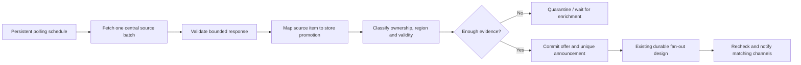

# Automatic discovery, good deals and manual sends

NEXT-09 — 2026-09-25: [ALERT_OPERATIONS.md](ALERT_OPERATIONS.md) selects launch review/offline/command behavior and records current live Epic comparisons. It supersedes conflicting earlier proposals in this historical research document. Current title matches do not establish certified regional eligibility or UTC deadlines.

Context refresh — 2026-09-19: AUD-04 continued the audit with transport guards, safer exception diagnostics and bounded autocomplete formatting; 232 tests and packaged smoke passed. Read [current status](PROJECT_STATUS.md), [progress report](PROGRESS_REPORT.md) and [audit report](AUDIT_REPORT.md). Phase 8 commands are implemented but inactive as of 2026-09-21; see [command notes](ALERT_COMMANDS.md). Phase 6 remains deferred and required before activation. Earlier measurements below are historical.

Research date: 2026-09-13. Status: **researched source/workflow design; identity refinements implemented in the initial engine**. See [ALERT_ENGINE.md](ALERT_ENGINE.md). Source adapters, deals and manual publishing remain unimplemented.

This extends [SYSTEM_ARCHITECTURE.md](SYSTEM_ARCHITECTURE.md). It selects candidate data sources and specifies optional deals and manual publishing. No API accounts were created, credentials requested, providers contacted, or Discord messages sent. Findings are based on provider documentation; production access, live response contracts and redistribution requirements must be validated before launch. One attempted unauthenticated GamerPower request could not be retrieved by the research browser, so it is not a successful API smoke test.

## 1. Recommendation

Start automatic giveaway discovery with **GamerPower**, then evaluate **IsThereAnyDeal (ITAD)** for additional coverage and regional deals. Keep direct storefront integrations optional until documented access and accurate promotion semantics are established. Use multiple sources as evidence for one promotion, not as independent reasons to notify twice.

Build free-game alerts first. Add **Good Deals** as a separate opt-in digest, using explicit thresholds and supported country/currency data. Add **manual send** through the same durable notification pipeline, with a preview, scoped authorization and audit trail. Neither is a shortcut around delivery safety.

## 2. Source research

The facts in this section are provider-documented; the integration choices below are our design recommendations.

### GamerPower — first giveaway-source candidate

Documented endpoints include `GET https://www.gamerpower.com/api/giveaways`, filters for `platform` and `type`, and `GET /api/giveaway?id={id}`. Steam, Epic Games Store and GOG are supported platform filters; types distinguish game, loot and beta. No key is required. The published ceiling is 10 requests/second. Documentation distinguishes a no-active-giveaways response from ordinary success. Personal/commercial use requires an active attribution link; ownership claims and resale of its data are restricted. [GamerPower API documentation and terms](https://www.gamerpower.com/api-read)

**Fit:** low-friction giveaway discovery across the requested stores. **Limit:** a listing is a candidate, not proof of a region-specific, permanently owned base-game entitlement. Do not infer those properties from a category alone.

### IsThereAnyDeal — preferred deals candidate, conditional on access fit

ITAD documents giveaways (`/giveaways/v1`), country/shop-filtered deals (`/deals/v2`), game prices (`/games/prices/v3`) and shop discovery (`/service/shops/v1`). API keys come from app registration; a header can carry the key. Its deals list selects a best deal per game, so it is not an exhaustive per-shop price feed. Terms permit certain public commercial apps but restrict competing uses, data alteration and affiliate-link removal; attribution is encouraged. Confirm that this bot's planned use and polling budget fit those terms before enabling it. [ITAD API and terms](https://docs.isthereanydeal.com/)

**Fit:** stronger basis for selected-country deals. **Limit:** no blanket permission or production quota is assumed. An app key alone does not settle suitability. Preserve supplied prices and required links; our filtering/ranking must not misrepresent source data.

### CheapShark — useful for lookup; not the default bulk poller

CheapShark's public API needs no key, requires a descriptive User-Agent, and requires its deal redirect links. Prices are USD; updates are generally hourly. Documentation warns against excessive automated catalog caching and describes request-driven use. Its redirect links are for people and block automated access. Its paged deals endpoint supports sale/price/review filters. [CheapShark's official API workspace](https://www.postman.com/cheapshark/cheapshark-s-public-workspace/documentation/7h22uhl/cheapshark-api)

**Fit:** a future on-demand deal search. **Limit:** not a basis for local-currency claims or a continuously mirrored catalog without an agreed usage arrangement. Do not fetch redirect URLs to scrape their destinations.

### Direct storefronts and an Epic-specific alternative

| Candidate | What was established | Design consequence |
| --- | --- | --- |
| Steam | The documented IStoreService/GetAppList supports pagination and modification/price-change signals with a key. It is a catalog/change interface, not a free-to-keep entitlement feed. [Steamworks](https://partner.steamgames.com/doc/webapi/IStoreService) | Optional identity/change enrichment; do not scan the full catalog every few minutes or equate free-to-play with a giveaway |
| Epic commerce services | The official commerce documentation is a different integration surface; this research did not establish a supported public, store-wide giveaway-feed contract. [Epic documentation](https://dev.epicgames.com/docs/epic-games-store/services/ecom) | Do not present a frontend/internal endpoint as a guaranteed official API |
| GOG | Official developer documentation includes a product price/discount widget, not an established store-wide promotion-discovery contract for this bot. [GOG widget documentation](https://docs.gog.com/gog-widget/) | Use the aggregator path initially; direct discovery remains uncertified |
| egdata | Its own documentation describes Epic catalog/pricing/free-promotion resources. It is a separate source, not an Epic-operated API. [egdata overview](https://docs.egdata.app/docs) | Evaluate as an optional Epic-specific source after confirming terms, quota and identity/region semantics |

Not finding a documented feed does not prove none exists. It means the launch design cannot depend on one being available. No undocumented Steam/Epic/GOG scraper is selected here.

## 3. How automatic finding actually works

### Separate source, store and redemption platform

This distinction changes the original model's overloaded `providerId`:

- `sourceId`: GamerPower, ITAD, a certified storefront adapter, or MANUAL.
- `storeId`: where the promotion is offered, such as Epic Games Store, Steam or GOG.
- `redemptionPlatform`: where the entitlement activates; a third-party store selling a Steam key is not the Steam store.
- `sourceItemId`: the source's listing identifier; useful for ingestion deduplication, not automatically a cross-source campaign identity.

Server-facing “providers” mean **stores**, not aggregators. Polling state is keyed by source and request scope. Subscriptions filter canonical store IDs. Aggregate source observations into canonical store/campaign/market offers; retain provenance and attribution per contributing observation.

Add AlertSourceObservations keyed uniquely by `(sourceId, sourceItemId, observationVersion)` and AlertSourceMappings keyed by `(sourceId, sourceItemId, occurrenceKey, market)`. Mappings point to the canonical offer and preserve the approved identity rule. Observation versions use a bounded relevant-content fingerprint; source diagnostic history is retained under explicit limits.

When store campaign IDs exist, map onto them. Otherwise use an adapter-certified occurrence key. Cross-source matching requires reliable item/edition IDs and compatible occurrence windows, not title similarity. Ambiguous matches remain quarantined. A fallback source may refresh evidence but cannot mint a second initial event for an already-mapped campaign. Reusing a source listing ID for a later giveaway must be covered by fixtures.

### Proposed polling plan

| Work | Initial design budget | Important restriction |
| --- | --- | --- |
| GamerPower discovery | One central full-game request every five minutes, with jitter | No separate request per guild; platform routing happens locally |
| ITAD giveaways/deals | Initial fifteen-minute central cycle per supported country, after usage validation | Shared page/batch cap; request only necessary coverage |
| Active-offer revalidation | Bounded shared refresh near expiry or stale evidence | Coalesce all destinations onto the same offer refresh |
| Optional CheapShark lookup | User-driven, cached bounded lookup | No unsolicited catalog sweeps |

These are proposed application cadences, not provider service-level promises. A source's editorial or pricing lag exists before our polling starts. Measure source age, fetch age and bot delivery lag separately. The original five-minute discovery objective is conditional on source freshness; it cannot be promised for every source above.

Limit concurrent fetches to one per source initially; use a source-wide request budget across markets, exponential backoff and jitter. Every source certification records page limits, conditional-request support, no-results semantics, timezone handling and access rules. A listing removed from a feed or absent from one page is not automatically an expired offer.

### Eligibility evidence, not just “price = 0”

Each candidate must establish base game versus DLC/demo, free-to-keep versus temporary access, claim conditions, store identity, edition, active window, supported market and trustworthy URL. Classify membership-required offers, random key draws and limited-key giveaways separately; exclude them by default. Missing dates or region fields mean unknown, not worldwide or forever.

The source adapter produces evidence with confidence and provenance. Auto-publish only policy-approved evidence combinations. A human can review unresolved candidates and supply an audited classification, but cannot mark an unsupported region as verified without evidence. If regional verification is unavailable for a source, keep that candidate pending rather than weakening the original market contract silently.

Keep both a validated canonical store URL for identity and a source-required outbound URL for display. Attribution is part of the rendered template. Approve intermediary/affiliate hosts separately from HTTP fetch hosts; do not strip required tags or automatically fetch every redirect. External URL validation must still reject credentials, executable schemes and internal network targets.

## 4. Good Deals — an optional product lane

The user requested exploration of a deals section. The following is a proposed design, not an approved ranking policy or an implemented feature.

### User experience

- Separate Free Games and Good Deals selections, with independent channels/roles and an explicit opt-in for deals. Existing free-game subscribers receive no paid-deal alerts by default.
- Proposed launch mode: one daily digest of up to five deals, not one notification for every price change. Store the guild's IANA timezone and local send time; derive an immutable local-date window so daylight-saving changes cannot create two digests.
- An on-demand `/deals browse` can display cached supported-country results privately. Unsupported markets show an explicit limitation, never a USD price relabeled as another currency.
- Every entry shows exact edition, actual store, redemption platform if relevant, observed sale price/currency, discount, price-check time, end time if known, source link and why it qualified. Do not imply the checkout price is guaranteed.

### Transparent qualification

Proposed starting rule: an active, verified base-game sale from an approved store, in the selected market, at least 50% off, within the server's optional native-currency price cap. Exclude zero-price offers from paid digests; the free-game lane owns them. Coupons, bundles, memberships, reseller marketplaces and DLC stay off initially.

Treat historical-low evidence and review quality as optional additional filters, not invented facts. Never label a price an all-time low without comparable source history for that store/edition/market/currency. Unknown historical data is visibly unknown. If the user enables a review threshold, missing review data fails that filter. Keep source prices intact; ranking is a separately labeled application policy.

Rank qualifying entries deterministically: verified historic-low status, then configured discount/price preference, then stable item ID. Version the policy and test it with fixtures. Reject duplicate editions of the same item in one digest. Keep only the best approved match per game under the selected store filters; do not imply a filtered result is the cheapest price anywhere.

### Persistence and repeat suppression

Add deal price observations with canonical game/edition, store, market, currency, sale/base amounts, observation time, source occurrence ID and eligibility evidence. Keep time-bounded history or use source-provided history; do not mirror an unlimited price catalog.

Subscriptions gain a topic: FREE_GAME or GOOD_DEAL. Unique subscription key becomes `(destinationId, storeId, topic)`. Roles and policies are topic-specific. Add a destination/topic schedule record for digests, with a revision, timezone and chosen local time.

Create one digest event per `(destinationId, incarnation, localDate, scheduleKind)` with a bounded list of selected offer IDs and policy version. Configuration revision is recorded but is not part of uniqueness: editing a schedule cannot create a second digest for the same window. Persist event creation and planned work atomically.

Before authorizing a digest, revalidate all entries and current subscription/role selections. Remove expired or disqualified entries; skip an empty digest. Ping the union of approved roles once per message. Suppress the same store/edition/market offer for seven days by default; a changed source ID or minor price oscillation does not reset suppression. A material price-drop repeat policy is deferred until explicitly designed.

Completed-digest evidence and repeat-suppression reservations must use conditional writes/transactions so concurrent builders cannot select the same suppressed item into overlapping sends. Uncertain digest outcomes retain suppression until reconciled. Retry uses the same digest identity and attempt rules as ordinary delivery.

### Capacity and priority

Free games remain the higher-priority lane. Deals use only residual admission capacity, initially capped at 20% of the alert-send application budget, and pause under interactive pressure or a free-game backlog. Both lanes share the global in-flight and Discord limits; lane-specific pools do not create extra platform quota.

At 1,000 servers and two digest destinations each, one daily digest means about 2,000 additional messages/day, assuming one message per digest. That is a planning scenario, not user-approved channel counts. Smooth equal local-time schedules with bounded deterministic jitter; do not launch 2,000 sends at midnight. Test combined giveaway bursts, digests and manual requests.

## 5. Manual send — preview, approve, enqueue, track

Manual send means **human-triggered publication through the durable pipeline**, not arbitrary `.sendMessage()` calls. All command names here are proposals.

### Two clearly separated scopes

| Actor | Allowed operation | Forbidden expansion |
| --- | --- | --- |
| Guild administrator with Manage Server / Administrator | Preview and send an eligible catalog item to configured channels in that same guild | Other guilds, arbitrary unconfigured roles/channels, ignoring disabled settings |
| Bot operator on explicit operator allowlist | Curate a missed promotion and publish to matching opted-in destinations, or a selected test cohort | Broadcasting to every guild regardless of subscription or bypassing rate/expiry checks |

No public command accepts a global guild list or a “force everywhere” flag. Operator actions are guild-restricted to the operations environment and identity-checked at every step. Server administrators cannot acquire operator scope through channel permissions.

### Proposed workflow

1. `/alerts manual preview offer:<id> channel:<configured-channel>` creates a private, five-minute preview. Use the existing catalog entry wherever possible. For operator ingestion of a missing item, require store, title/edition, approved URL, ownership type, market, start/end or freshness evidence, and a reason.
2. Show the exact content, source attribution, roles, scope, eligible destination count, skipped reasons and whether this promotion has already been sent. A preview sends nothing to destination channels.
3. Persist a ManualRequest with creator, guild/operator scope, content hash, canonical offer identity, bounded target plan, revisions, expiry and idempotency key. A mass audience is a paged durable target plan, not a giant embedded array.
4. Confirm through an owner-bound control. Recheck the actor's current authority and the preview revision/expiry. If content, roles or target eligibility changed materially, require a refreshed preview rather than silently widening publication.
5. Atomically transition DRAFT → CONFIRMED and create durable events/jobs (or resumable fan-out work). A repeated confirmation returns the same request and cannot enqueue twice.
6. Expose `/alerts manual status request:<id>` with queued/sent/skipped/failed/uncertain counts. Optional cancel stops unclaimed work; already-authorized sends may still arrive. Receipts and audit identify the authorizing actor.

Operator mass preview planning freezes a bounded-by-plan target set across paged records and gives a final count before confirmation. Confirmation must not include newly added destinations. Revalidate every planned destination at dispatch; removals can shrink the audience, never expand it. For large plans, the preview expiry starts when plan generation completes, not when it begins.

### Deduplication and source outages

Sending an existing promotion manually uses its **same initial announcement identity** and event/channel uniqueness as automatic delivery. If already sent, report that result and enqueue nothing. If the channel did not receive it, the manual action can create the missing job, with an explicit catch-up intent limited to the approved guild/target plan. It does not change automatic enabledSince rules globally.

A newly curated promotion must resolve to the same canonical store/campaign identity that later automatic ingestion would use. If it cannot be mapped safely, keep it as a draft. Source outage is not permission to invent prices, regions or claim terms.

A previously SKIPPED or FAILED job is not silently overwritten; an authorized manual recovery records an audited transition and rechecks eligibility. UNCERTAIN remains subject to reconciliation. SENT is never redriven by this command. An intentional repeat announcement needs a separate future product policy.

Manual paid-deal sends require the GOOD_DEAL topic opt-in. Selecting manual mode cannot inject paid promotions into free-only subscriptions. Default to the existing catalog schema; arbitrary freeform announcements are outside scope.

Separate **notification identity from audience planning**. A manual post must not prevent later automatic discovery from reaching other eligible channels. AlertFanout therefore becomes a plan record keyed by planId, with eventId, origin, cutoff and optional manualRequestId. Enforce one automatic plan per event and one manual plan per confirmed request/event. On first eligible automatic observation, create its automatic plan even if the canonical event already exists from manual curation. Use that plan's automatic observation time for its subscription cutoff; existing jobs still deduplicate by event/channel. Manual plans retain their fixed approved targets. Event creation origin is provenance only, never the sole switch deciding whether automatic fan-out may run.

### Controls and storage

Add AlertManualRequests (unique requestId and interaction idempotency key) and AlertManualTargets (unique requestId/channelId). Store state, actor, scope, approval revision, payload hash, preview expiry, counts and outcome links. Cleanup must preserve publication/idempotency evidence through the same replay horizon as its jobs.

Proposed controls: one active mass preview per operator, ten guild-local confirmations per hour per guild, shared queue limits, default test-cohort preview, operator audit and a manual-publishing kill switch. These are configurable product budgets, not platform limits. Manual requests do not bypass normal send priority, rate limits, current destination checks, mention allowlists or lease ownership.

## 6. Required changes to the main architecture model

These are design refinements, not database migrations performed now:

| Original concept | Refined contract |
| --- | --- |
| providerId used for both polling and subscription | sourceId for fetching; storeId for user selection; redemptionPlatform kept separate |
| Initial-available events only | Typed notification envelope: FREE_GAME_AVAILABLE or DEAL_DIGEST, plus origin AUTOMATIC/MANUAL |
| Every event has one offerId | Free events reference one offer; digest events reference a bounded item manifest and one destination/window |
| One event identity rule | Free: canonical promotion occurrence; digest: destination/incarnation/window; origin is excluded from free-event identity |
| Automatic audience cutoff | Remains for automatic alerts; explicit manual catch-up uses a fixed approved target plan |
| Fan-out unique by eventId | Fan-out keyed by planId, with unique automatic event plan and unique manual request/event plan |
| Single delivery preflight | Dispatch by event type: single-offer verification or digest-entry verification; shared authorization and transport |

Use a stable notificationKey unique index on the event envelope. Free events retain their canonical offer/type uniqueness; digests use their destination/window key. Every delivery retains eventId/channelId uniqueness. ManualRequest IDs identify approvals, not new promotions. Event payloads are versioned discriminated types; unsupported types become visibly blocked, never partially processed.

Primary module additions: source registry and provenance mapping; deal qualification/digest builder; manual preview/approval application service. All three use the existing repository ports and delivery safety contracts. No separate untracked sender exists.

## 7. Acceptance tests and activation order

1. Certify GamerPower with saved fixtures and a bounded live read: success, no-results, malformed payloads, unknown dates, platform ambiguity and source refresh behavior. Verify attribution in every resulting message.
2. Establish ITAD access/usage fit before writing production polling assumptions. Test store filters, country/currency handling, deduplication across sources and restricted links. Enable deals in shadow mode first.
3. Test stale/oscillating prices, exact edition matching, absent history/reviews, changing currencies, digest emptying at send time, daylight-saving windows and seven-day suppression.
4. Test cross-guild manual inputs, stolen/expired preview controls, permission revocation, repeated confirms, changed roles, audience growth after preview, cancel-versus-send races and operator-scope denial.
5. Kill the process during preview planning, confirmation, fan-out, send and receipt recording. Retry confirmation and automatic discovery afterward; no new logical duplicate may appear.
6. Verify manual plus automatic publication of the same campaign deduplicates, including when one source is unavailable. Verify a paid deal cannot reach a free-only subscription.
7. Run the combined 1,000-server workload with giveaway bursts, scheduled digests and manual traffic while existing commands remain active.

Suggested order: source certification → automatic free-game shadow mode → guild-local manual previews/test sends → free-alert canary → operator manual publishing → opt-in deals digest after access and ranking decisions. All activation still requires the future implementation/deployment request.

Phase 9 update — 2026-09-21: initial inactive GamerPower candidate decoder and synthetic fixtures now exist; see [discovery notes](ALERT_DISCOVERY.md). Official documentation and one feed were read through the research browser. This supersedes the earlier research-only/no-successful-read status; no application HTTP transport, certified mapping, durable poller or live publication is implemented.

