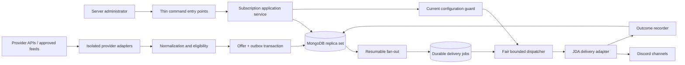
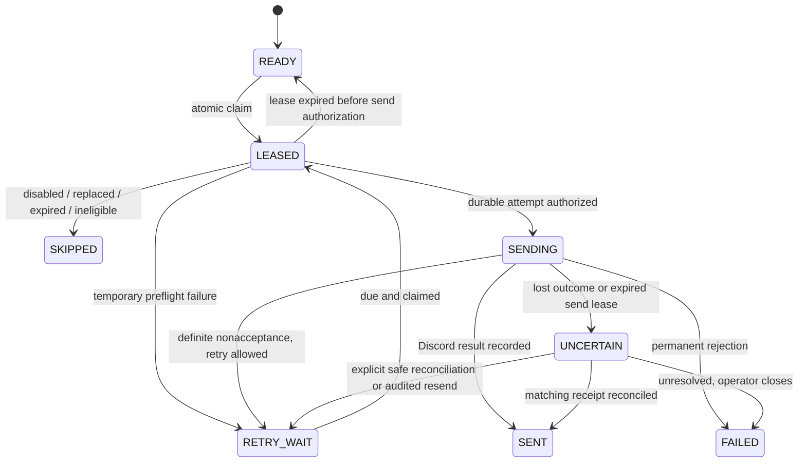

# BunnyNexus system architecture

OWNER-01 / NEXT-10 — 2026-09-25: [owner-controlled publication](ALERT_OWNER_REVIEW.md) adds durable owner-only prepare → verify → bounded release, a mandatory transactional send gate, additive review/audit migration, and stop-before-start upgrade rules. This supersedes OPS-01's single approval; unapproved legacy jobs cannot authorize sends. No runtime activation.

NEXT-09 decisions — 2026-09-25: the user delegated command, review and offline-recovery design choices. [ALERT_OPERATIONS.md](ALERT_OPERATIONS.md) is now the authoritative addendum for selected launch behavior, OPS-01/02/03, evidence and staged implementation. Conflicting earlier proposals below are superseded. Delivery remains inactive; human review persistence/transactional enforcement and certified transport are still required.

Latest verification — 2026-09-23 (VERIFY-01): phase-6 database verification resumed by user. **12 real three-node MongoDB integration tests passed** (claims/polls/configuration, authorization/receipt contention, fan-out replay, uncertain recovery and primary crash); **two synthetic 6,000/20,000-job load scenarios passed**. Genuine GamerPower 201/404/200 fixtures captured; exact documented 201 no-results envelope now accepted with strict validation. Final JDK 21 clean verify **301 tests passed**, packaged smoke passed; test processes stopped. See [verification scope, measurements and remaining gates](ALERT_VERIFICATION.md). Logs: .tools/mongo-replica-final.log, .tools/delivery-load.log, .tools/verification-final.log, .tools/verification-smoke.log. Schemas installed only in disposable local test databases; no live GBF access, bot restart, recurring polling or Discord send. Source eligibility and real transport/load certification remain incomplete.

Context refresh — 2026-09-19: AUD-04 continued the audit with transport guards, safer exception diagnostics and bounded autocomplete formatting; 232 tests and packaged smoke passed. Read [current status](PROJECT_STATUS.md), [progress report](PROGRESS_REPORT.md) and [audit report](AUDIT_REPORT.md). Phase 8 commands are implemented but inactive as of 2026-09-21; see [command notes](ALERT_COMMANDS.md). Phase 6 remains deferred and required before activation. Earlier measurements below are historical.

Version: 1.1 — 2026-09-13  
Status: **design blueprint; engine, storage, configuration and ownership/scheduling foundations implemented, service not activated**  
Scope: BunnyHub runtime, existing BunnyNexus features, and the planned free-game alert product.

For implementation status, sequencing and agent ownership, read [IMPLEMENTATION_TODO.md](IMPLEMENTATION_TODO.md); the latest source review is [CODE_AUDIT.md](CODE_AUDIT.md).

This is the primary architecture document for implementation. It refines [the original alert plan](FREE_GAME_ALERTS.md). On 2026-09-13 the user authorized starting the system classes/engine after reviewing the handler. [ALERT_ENGINE.md](ALERT_ENGINE.md) records the implemented foundation and verification limits. Provisioning and live notifications are not authorized by that request.

Version 1.1 adds [researched sources, optional good deals and manual sends](ALERT_SOURCES_AND_FEATURES.md). That companion is part of this blueprint. Its section 6 refines the original provider/event/fan-out schema below: sources and stores are distinct, events are typed, and audience plans are separate from notification identity. Read both before defining migrations; the original tables are not a complete schema for the expanded feature set.

The foundation is a set of enforceable contracts, not a promise that technology will never change. Preserve identity, ownership, durability, bounded resource use, and observable outcomes. Change implementations through documented architecture decisions and migration tests. No architecture can eliminate provider outages or make two independent systems commit atomically.

## 1. Product contract and decision status

### Confirmed requirements

- About **1,000 Discord servers** at launch.
- Each server chooses destination channels, roles to notify, and providers such as Epic Games, Steam and GOG.
- Discover promotions automatically and centrally; notify matching destinations.
- Keep timer, subject editing, GPA, info and Avatar commands working during notification bursts.
- Keep command implementations as named classes in the established BunnyNexus command package.
- The earlier design-only task is complete; the subsequent engine implementation request covers the initial foundation. Activation remains a separate release step.

### Proposed launch defaults

These make the blueprint concrete. They are **not user-approved product commitments**. Confirm them before enabling the corresponding behavior.

| Decision | Proposed default | Reason / extension point |
| --- | --- | --- |
| Eligible promotion | Base games temporarily free to keep | Trials, free weekends, permanently free games and DLC are separate offer types, disabled initially |
| Configuration granularity | Provider and role selections per channel | Two channels can follow different providers and ping different roles |
| Region | One explicitly selected market per destination | Never imply worldwide availability from one regional result |
| Language | English initially | Locale remains an explicit rendering input |
| Destination limits | Five channels per guild, five roles per channel/provider | Application limits, not Discord limits; revise using measurements |
| Joining / enabling a provider | New observations after activation; no automatic backlog | An explicit future catch-up action must have its own notification policy |
| Existing promotion edits | Update stored metadata; no second announcement | Initial announcements have stable identity; corrections need a later policy |
| Same title on different stores | Separate promotions | Claim terms and availability differ |
| Provider unavailable / ambiguous eligibility | Do not announce unverified offers | Mark stale or quarantine; do not invent an expiry |
| Unknown Discord send outcome | Quarantine for reconciliation; no blind resend | Avoid repeated role pings; may delay or miss delivery until resolved |
| Channel types | Ordinary guild text channels | Threads, forum posts, DMs and announcement crossposting require separate contracts |

## 2. Non-negotiable engineering rules

| ID | Invariant | Evidence required before release |
| --- | --- | --- |
| A1 | A guild can configure only its own destinations and roles | Cross-guild authorization tests on every write path |
| A2 | Discovery frequency depends on providers/markets, not subscriber count | Increasing guild count does not increase provider calls |
| A3 | A committed announcement event is recoverable until fan-out completes or is explicitly cancelled | Crash tests between every persistence boundary |
| A4 | One logical initial announcement has at most one job per channel | Database uniqueness plus replay tests |
| A5 | No unbounded queue, scan, response body, retry loop or embedded history | Declared limits and overload tests |
| A6 | A worker can mutate only the current lease it owns | Conditional writes using ownership token and generation |
| A7 | A disabled/replaced subscription is rechecked before a new send is authorized | Configuration-versus-send race tests |
| A8 | Role mentions are explicitly allowlisted per message | Serialized payload tests, including hostile provider text |
| A9 | Discord calls never occur inside retryable database transactions | Boundary tests and code review |
| A10 | Unknown external outcomes are represented as unknown | Accepted-send/crash and lost-response tests |
| A11 | Alerts cannot consume the interactive executor or an unbounded JDA request queue | In-flight bounds include asynchronous completion |
| A12 | Every accepted job has an observable current or terminal outcome | Reconciliation of fan-out counts, jobs and receipts |

“No throttling” is not a requirement. Predictable backpressure, fairness and recovery are requirements.

## 3. Logical architecture



**Launch deployment:** one active Java application, one existing bot identity, one transaction-capable MongoDB deployment. Use a modular monolith: separate domain modules and interfaces in one process. No Kafka, Redis, microservice fleet or per-guild worker at launch. Durable jobs are stored in MongoDB, not in Java collections.

This choice preserves the current Java/JDA/Mongo investment and keeps operational ownership small. It also means one application outage pauses discovery and delivery. Recovery is durable; uninterrupted application availability is not promised. A production Mongo replica set should span independent failure domains through the chosen hosting service; backups are separate from replication.

### Module ownership and dependency direction

| Module | Owns | Must not own |
| --- | --- | --- |
| BunnyHub handler | Routing, access gates, bounded interactive work, lifecycle hooks | Offer rules, subscriptions, provider code |
| Alert domain | Immutable offer identities, eligibility policies, job transitions | JDA events, Mongo collections, HTTP clients |
| Alert application | Configure, ingest, fan out, authorize sends, reconcile | Direct dependence on transport-specific events |
| Provider adapters | HTTP contracts, parsing, provider-specific identity | Guild iteration or Discord sends |
| Mongo repositories | Atomic writes, leases, paging, schema conversion | Rendering or user-facing business decisions |
| Discord adapter | Validate destination capabilities, render/send, classify outcomes | Provider polling or authoritative job state |
| Operations | Health, metrics, repair tools, kill switches | Hidden bypasses around ownership or deduplication |

Dependencies point from transport/storage adapters toward application interfaces and domain types. Domain tests must run without JDA, Mongo or the network. The composition root constructs dependencies; new alert modules do not use static DB/service locators.

### Proposed source layout

```text
org.bunnys.commands.alerts                         thin registrations
org.bunnys.bunnynexus.commands.alerts              named command implementations
org.bunnys.bunnynexus.alerts.domain                values, policies, transitions
org.bunnys.bunnynexus.alerts.application           use cases and ports
org.bunnys.bunnynexus.alerts.adapters.providers    epic / steam / gog
org.bunnys.bunnynexus.alerts.adapters.mongo        repositories, migrations
org.bunnys.bunnynexus.alerts.adapters.discord      rendering and transport
org.bunnys.bunnynexus.alerts.runtime               schedulers, composition, metrics
```

Representative ports: ProviderAdapter.fetch, OfferRepository.commitObservation, SubscriptionRepository.updateExpectedRevision, FanoutRepository.commitPage, DeliveryRepository.claim/authorize/complete, DiscordDelivery.send, Clock, Metrics. Return explicit result types, including UnknownOutcome; do not encode state transitions as arbitrary exception strings.

The existing timer services retain their BSON schemas and transactions. Alert data never goes inside BunnyUsers or TimerData. Existing static handler/router state still limits the process to one BunnyHub client; removing it is a prerequisite for a different runtime topology.

## 4. Identity and terminology

- **Game:** a catalog item/edition; display title is never an identifier.
- **Campaign:** a particular provider promotion occurrence. A returning promotion is a new occurrence even for the same game.
- **Offer:** campaign availability and terms in one market, with typed eligibility evidence.
- **Announcement event:** the immutable instruction to consider announcing that offer occurrence. It is not every metadata update.
- **Destination:** one guild channel with an immutable destination ID and incarnation; disabling and deleting are distinct.
- **Subscription:** one destination/provider pair with market, role IDs, activation time, enabled state and revision.
- **Delivery job:** the logical announcement to one channel, not a network attempt.
- **Attempt:** one authorized external send lifecycle with its own identifier and timestamps.

Use opaque IDs for domain records, strings for Discord snowflakes, UTC instants for persisted times, integer minor units/currency for prices, and explicit enums for offer types. Never use floating-point price comparison to decide whether something is free.

Each adapter must document how it derives `campaignKey`. Prefer authoritative campaign IDs. If absent, use a validated provider-specific combination of item/edition and promotion occurrence boundaries. Do not hash titles or all mutable metadata. If the source cannot distinguish a recurring campaign from an old scrape, quarantine the observation until its identity rule is proven by fixtures.

`offerKey = (providerId, campaignKey, market)`  
`eventKey = (offerKey, INITIAL_AVAILABLE)`  
`deliveryKey = (eventId, channelId)`

Metadata revision is independent of event identity. Repeated polls, price-format changes, images or title corrections cannot create another initial event. Region is a single destination choice at launch, preventing regional variants from multiplying messages to that destination. Future multi-region selection requires explicit collapse semantics.

Render an unsent announcement from the latest validated content for that same offer identity, with the immutable event snapshot retained as discovery evidence. Freeze contentRevision, template version, approved roles and payload hash on each authorized attempt. A retry after definite nonacceptance performs authorization again; an uncertain attempt is never silently re-rendered and resent. Changes to an already-sent message remain outside the initial release policy.

## 5. Persistent model and indexes

Names below are proposed new collections. All records carry schemaVersion. Mutable records carry revision. IDs and ownership keys are immutable. Arrays are capped; jobs and attempts are separate records.

| Collection | Minimum fields | Required indexes / principal query |
| --- | --- | --- |
| AlertGuilds | guildId, enabled, configRevision, createdAt, deletedAt | Unique guildId; direct authorization guard |
| AlertDestinations | destinationId, incarnation, guildId, channelId, enabled, revision | Unique channelId; guildId + enabled + destinationId |
| AlertSubscriptions | subscriptionId, destinationId, providerId, market, roleIds, enabled, enabledSince, revision | Unique destinationId + providerId; providerId + market + enabled + subscriptionId for keyset scan |
| AlertProviderState | providerId, market, nextPollAt, lastSuccessAt, sourceVersion, leaseToken, leaseUntil, circuitState | Unique providerId + market; nextPollAt; leaseUntil |
| AlertOffers | offerId, offerKey fields, type, eligibility, startsAt, endsAt, lastVerifiedAt, contentRevision, validated content | Unique providerId + campaignKey + market; endsAt |
| AlertEvents | eventId, eventKey fields, observedAt, payloadVersion, immutable normalized snapshot | Unique offerId + eventType; observedAt |
| AlertFanout | eventId, state, afterSubscriptionId, leaseToken, generation, leaseUntil, counters | Unique eventId; state + nextAttemptAt + eventId; state + leaseUntil |
| AlertDeliveries | jobId, eventId, guildId, channelId, destinationId/incarnation, subscriptionId, state, dueAt, attemptCount, leaseToken/generation/until, result, messageId | Unique eventId + channelId; state + dueAt + jobId; guildId + state + dueAt + jobId; state + leaseUntil |
| AlertAttempts | attemptId, jobId, ordinal, nonce, payloadHash, subscriptionRevision, startedAt, outcome, messageId | Unique jobId + ordinal; jobId + startedAt |
| AlertAudit | actionId, actorId, guildId, action, configRevision, bounded change summary, createdAt | Unique actionId; guildId + createdAt |
| AlertSchema | migrationId, checksum, appliedAt | Unique migrationId |

The table specifies access patterns, not a claim that every compound index is already optimal. Before shipping migrations, use explain plans on representative mixed-state data. Due work and expired leases use separate indexed queries, not a broad OR scan. Retention uses a separate optional purgeAt date field and its own TTL index.

Repository methods require bounded page sizes; no future subscriber scan may call the existing unbounded DB.findMany. Proposed page size: 100, hard maximum 500. Claim windows cannot exceed free in-flight slots. Store raw source bodies only as capped, short-lived diagnostic samples; normalized offer payload maximum 32 KiB is a starting budget, not a Discord payload limit.

## 6. Configuration and authorization contract

1. A configuration command must originate in a guild. Require Manage Server or Administrator, including on autocomplete that exposes configuration data. Every modal/button must verify actor and guild, not trust IDs embedded in its custom ID.
2. Resolve the channel inside that guild; validate supported type and bot view/send/embed capabilities. Validate every role against that same guild and reject the everyone role. Start without requiring broad Administrator or Mention Everyone permission.
3. Store roles as distinct explicit IDs, with an empty set meaning no ping. A role that cannot be mentioned under actual permissions must be rejected during setup, not silently converted into a broader mention.
4. Commit the configuration change with expected revision and audit record atomically. Use the Discord interaction ID as an idempotency key for configuration retries. A stale editor receives a reload/conflict result.
5. A destination cap must be enforced transactionally under the guild record, not through count-then-insert. Concurrent commands cannot each claim the final slot.
6. Disabling a guild/destination/provider takes effect for subsequent send authorizations. Deletion leaves a tombstone long enough to invalidate old references. Recreating the same channel creates a new incarnation; old jobs cannot attach to it.

Subscription enable or material eligibility changes reset enabledSince. Role-only edits do not create new eligibility. Changing market cancels eligibility for older market jobs and starts fresh. Configuration revision never becomes part of delivery uniqueness: editing roles must not cause a second announcement.

**Unsubscribe race boundary:** before submitting to Discord, the worker atomically reads and touches the guild/destination/subscription guard records while authorizing the attempt. Configuration writes touch the same guards, forcing transaction conflict rather than relying on snapshot reads alone. Whichever commits first defines the order. Once an attempt is authorized, a later disable cannot guarantee cancellation of a request already leaving the process. The UI must say that one already-dispatched alert may still arrive. No database lock can revoke an external message already accepted by Discord.

## 7. Discovery protocol

Poll centrally per provider/market, with jitter, conditional HTTP requests where supported, and persistent nextPollAt. One adapter cannot consume another adapter's concurrency budget. Initial proposed budget: one active fetch per provider, 10-second total fetch deadline, 2 MiB decompressed response cap, bounded pages and redirects. These are tunable safety budgets; source contracts may require different values.

The provider interface returns an explicit complete/partial result, source timestamp/version where available, normalized candidates, and freshness evidence. Failed or partial pages do not expire missing offers. A complete response may support provider-specific withdrawal logic, but only after that adapter's completeness semantics are proven.

For each candidate:

1. Validate schema, URL, identity, market, ownership type, temporal window and free-price evidence. Unknown is distinct from eligible.
2. Compare with the existing offer using contentRevision and provider ordering metadata. A stale fetch cannot overwrite a newer observation. Provider leases prevent overlapping normal polls; generation checks reject late poll results.
3. In one bounded transaction, update the offer and, on its first eligible occurrence, insert the immutable event plus initial fan-out record. Unique event keys make retries safe.
4. Scheduled future offers remain scheduled until their start and fresh eligibility are confirmed; do not announce them as currently claimable.

Transaction callbacks must contain only repeatable database work, with stable IDs allocated before retries. MongoDB's callback transaction API includes retry handling for certain transaction/commit errors; every transaction operation must use its session. Application deadlines still bound the whole operation. [MongoDB transaction API](https://www.mongodb.com/docs/manual/core/transactions-in-applications/)

Source adapters for Epic, Steam and GOG are **not yet selected or certified**. Before enabling each, record endpoint ownership, permitted access, request budget, pagination, market semantics, campaign identity, withdrawal behavior and fixture coverage. A guessed public endpoint is not a production integration contract. Do not work around access restrictions.

Research now identifies GamerPower as the initial giveaway-source candidate and ITAD as a conditional regional-deals/additional-coverage candidate. Direct storefront adapters remain uncertified. The [source decision and polling protocol](ALERT_SOURCES_AND_FEATURES.md) specifies endpoints, terms, evidence handling and the distinction between source and store. No source is production-certified merely by appearing in this design.

## 8. Fan-out protocol and subscription timing

An event is discovered once; fan-out is recoverable work, not a loop hidden inside its poll callback.

1. Claim an event's fan-out record with an atomic state/token/generation update.
2. Scan enabled subscriptions matching provider/market in immutable subscriptionId order after the saved cursor, in pages of 100. Apply enabledSince <= event.observedAt.
3. For each eligible record, insert a delivery job using eventId/channelId uniqueness and store its destination incarnation. Duplicate-key replay means the job already exists; it must not reset a sent/failed job.
4. Commit that page's new jobs and cursor advance in one transaction guarded by the fan-out lease. Cursor advancement is never committed before jobs exist.
5. Commit COMPLETE after the final empty page. Reconcile inserted/duplicate/skipped counts for diagnostics; counters do not replace unique constraints.

This is **eligibility-at-page-processing with an activation cutoff**, not a historical snapshot of all subscribers. A concurrent disable can suppress a job; an activation after observation receives no old event. Changes are checked again on send. If point-in-time subscriber membership becomes a product requirement, add versioned eligibility intervals through a migration rather than claiming this scan already supplies it.

Do not persist thousands of channel IDs in an event or hold a transaction across the whole audience. If the durable backlog reaches its safety watermark, pause fan-out and retain the cursor. Resume later, expiring offers according to policy; never drop pages to reduce queue length.

## 9. Delivery state machine



SENT, SKIPPED and FAILED are terminal for normal processing. Manual redrive uses the same logical job with an audited transition, not a new delivery identity. Never redrive a SENT job to manufacture another ping. An intentional repeat notification is a separate product action.

### Send transaction and external boundary

1. Reserve an in-flight slot and a fair scheduling turn; then claim a due job atomically. Do not lease an entire backlog in advance.
2. Validate current offer eligibility/freshness, destination incarnation, enabled state, market and permissions. Snapshot the current approved roles. Expired offers become SKIPPED, not retried.
3. Commit LEASED → SENDING with the guard touches described in section 6, a new attempt ID, deterministic per-job nonce, template version and payload hash. Check lease token/generation and remaining validity. No Discord request occurs before this commit succeeds.
4. Send exactly that authorized payload through the Discord adapter. Hold the in-flight slot until completion or confirmed cancellation; `.queue()` returning does not release it.
5. Persist success with messageId and attemptId using conditional ownership updates. If the database is unavailable after a successful response, stop admitting new sends and retain a bounded completion buffer while retrying persistence. A process crash still makes the outcome uncertain.
6. A late success receipt for the same unresolved attempt may reconcile UNCERTAIN → SENT, but may not overwrite a later attempt or terminal contradictory outcome. Mismatches create an operator reconciliation record.

Proposed leases: 60 seconds with renewal every 15 seconds, measured and adjusted against actual JDA queue/HTTP lifetimes. Use database time for distributed lease comparisons; monotonic local time for elapsed budgets. Expired LEASED jobs are reclaimable; expired SENDING jobs are UNCERTAIN, never automatically READY. Database fencing prevents stale writes, **not an already-issued Discord request**.

### Honest delivery guarantee

Durable internal work is processed at least once and deduplicated by stable keys. A successful send and its database receipt cannot be committed atomically. Therefore the system does **not** promise exactly-once visible messages or guaranteed delivery of ambiguous attempts.

Discord documents nonce enforcement over a recent, limited window. Treat it as additional protection, not permanent deduplication. Verify that the selected JDA API serializes the required fields and characterize timeout/cancellation behavior before enabling automatic ambiguous retries. [Discord Create Message](https://docs.discord.com/developers/resources/message#create-message)

The default uncertain-outcome policy parks the job and alerts operations. Reconciliation may use a known message ID or a bounded, permission-approved history lookup with a unique visible delivery marker. Absence from a limited history scan is not proof no message was sent. If reconciliation cannot establish the result, an operator may choose an audited resend accepting duplicate risk, or close it unresolved. Uncertain jobs count against the delivery-success objective.

## 10. Scheduling, rate limits and retries

Use a dedicated alert dispatcher; never route fan-out or bulk sends through executeForUser. Proposed starting controls: eight in-flight sends, one in-flight send per channel, and a configurable admission ceiling initially simulated at 20 sends/second. These are application budgets, not entitlements or measured throughput.

Select due work into a bounded candidate window. Schedule round-robin by guild, then channel. Supplement the global oldest-due query with guild-specific indexed refill queries so one noisy guild cannot occupy the whole candidate window. At launch, a bounded registry of configured guild IDs is affordable; grow it through paged enumeration and rotate the starting position. Keep fairness state disposable—job state remains authoritative. Preserve approximate FIFO within a channel; retries may allow later independent offers through, so strict ordering is not promised.

JDA handles Discord route limits. Application admission must also react to queue latency and shared capacity. Rate limits are dynamic; obey headers and Retry-After rather than hardcoding a platform ceiling. Interaction endpoints have different global-limit treatment from ordinary bot messages, but CPU, network and many ordinary bot REST calls still share resources. [Discord rate limits](https://docs.discord.com/developers/topics/rate-limits)

| Outcome | Action |
| --- | --- |
| Confirmed success | Persist SENT + messageId |
| 429 handled by transport | Keep the same attempt in flight; do not schedule a second application retry |
| Definite pre-send connectivity failure | RETRY_WAIT with backoff |
| Timeout/reset after submission or ambiguous server failure | UNCERTAIN unless adapter can prove nonacceptance |
| Missing channel / removed guild | Disable destination or guild and skip related unsent work in bounded batches |
| Missing permission | Suspend destination, record reason, require repair; prevent repeated 403 storms |
| Invalid token | Global delivery stop; operator action |
| Invalid payload | FAILED, template/provider diagnostic; do not blame server configuration |
| Offer expired / configuration removed | SKIPPED with reason |

Retry definite transient failures with full jitter: random delay from zero to min(15 minutes, 5 seconds × 2^attempt). Respect a longer provider/Discord retry instruction. Proposed maximum eight actual send attempts and 24 hours job age, always bounded earlier by offer expiry and freshness policy. Waiting on local admission is not a send attempt. Never create an application retry while the original JDA action could still transmit.

The Discord adapter must enforce a total request deadline that includes waiting in its rate-limit queue and cannot exceed the authorized offer window. Prove cancellation/deadline behavior in transport tests: a timed-out future alone is not evidence that the request cannot still send. If cancellation cannot be confirmed, keep the attempt uncertain, stop new admission when its bounded slot cannot be safely released, and escalate. Do not free capacity by forgetting potentially live requests.

## 11. Resource budgets and service objectives

The following are **proposed acceptance targets**, not production guarantees. Hosting size, markets, channel distribution and source budgets must be measured before launch.

| Measure | Initial target / limit |
| --- | --- |
| Launch workload | 1,000 guilds, representative two channels each, three simultaneous offers: 6,000 jobs |
| Discovery lag | p95 within five minutes of availability in a healthy approved source; source lag measured separately |
| Delivery lag | p95 within ten minutes of committed observation for the 6,000-job healthy burst |
| Interactive regression | p95 command execution latency no worse than 20% above the same-host baseline during the burst |
| Provider freshness | Adapter-specific budget; proposed ten minutes before suppressing an unverified send |
| In-memory candidates | Maximum 200 delivery references, eight active sends initially |
| Durable pressure watermarks | Pause fan-out at 100,000 nonterminal jobs; resume below 80,000, subject to storage monitoring |
| Unfinished fan-out events | Pause new announcement ingestion at 10,000; resume below 8,000 |
| Background database parallelism | Start at four operations, leaving interactive pool headroom; tune from checkout/latency metrics |
| Recovery target | Resume durable work within ten minutes after healthy application/database service returns |

If source freshness expires while a backlog waits, refresh the offer centrally before sending or skip it explicitly. Never refresh once per destination. Unknown end times require fresh evidence; they do not make an offer indefinitely eligible.

Apply storage watermarks across all alert stages, not only deliveries. At a critical disk/storage budget, pause nonessential discovery/event writes while reserving capacity for receipts and configuration disables. Keep provider polling cursors unadvanced when ingestion is refused, and mark discovery degraded; a short-lived promotion may be missed during such an outage. Bound candidates per provider batch as well as bytes. Compact identity tombstones consume storage over time and require capacity forecasts or a provider-specific, tested replay horizon before deletion.

`messages = guilds × matching channels × offers × messages per offer`  
`ideal drain seconds = messages / effective successful sends per second`

For 6,000 messages, illustrative rates of 10/20/30 per second give 600/300/200 seconds before retries, route limits and pauses. A 20,000-message burst at 20 per second needs at least 1,000 seconds. More threads do not remove that lower bound. Alert on estimated drain time relative to remaining offer lifetime. Record missing/uncertain/skipped outcomes alongside latency so dropped work cannot improve percentiles deceptively.

## 12. Security and privacy boundaries

- **Untrusted inputs:** Discord users, provider text, URLs, metadata, custom IDs and error bodies. Parse into bounded typed values; reject unknown fields that affect identity or authorization.
- **Outbound HTTP:** fixed approved provider hosts, HTTPS, no user-supplied fetch URL, bounded redirects with host/IP checks at every hop, private/link-local/metadata address rejection, connection and decompression limits. No arbitrary remote image downloads. Egress policy is defense in depth against SSRF and DNS rebinding.
- **Rendering:** escape provider text, cap all fields and the aggregate message, use validated claim URLs, preserve a stable template version. Bad images are optional; they must not stop a valid text alert.
- **Mentions:** explicit empty parse/users, exact configured role IDs only, replied-user false. Never enable global role/everyone parsing. Missing roles are removed from the authorized payload or suspend configuration according to the setup policy; never substitute another role. [Discord allowed mentions](https://docs.discord.com/developers/resources/message#allowed-mentions-object)
- **Secrets:** deployment secret store/environment, no tokens or connection strings in commands, URLs, exception replies, diagnostic exports or logs. Restrict DB network access and runtime credentials to required collections/operations. Migration credentials are separate from runtime credentials.
- **Operator power:** pause/resume and redrive require explicit operator authorization and audit. Redrive tooling cannot bypass destination ownership, role allowlists, expiry or deduplication.
- **Data minimization:** store guild/channel/role IDs, configuration actor IDs and delivery receipts; do not collect guild message content or member lists for alerts. Provide guild configuration removal and documented retention behavior.
- **Supply chain:** pinned reviewed dependencies, SBOM/advisory checks in release CI, secret scanning, artifact exclusions and reviewed updates. Existing passing tests are not a vulnerability scan.

## 13. Retention, backup and replay safety

Proposed defaults: attempts and audit summaries 30 days, terminal delivery details 90 days, quarantined source samples seven days. Active/uncertain work has no automatic TTL. Unresolved work older than its processing window triggers operator review and an explicit terminal transition.

Do not delete uniqueness evidence before replay is impossible. Keep compact campaign/event identity tombstones after payload cleanup; an old provider observation must not become a new announcement because history was purged. Delivery receipts can be compacted only after fan-out is complete, no active attempts remain, the event is closed to replay, and the replay watermark is durably advanced. Archive or manual replay of an old event must consult that watermark rather than recreate jobs.

Set purgeAt only when cleanup is safe. TTL is asynchronous storage cleanup, not a clock for job eligibility or lease expiry. [MongoDB TTL behavior](https://www.mongodb.com/docs/manual/core/index-ttl/)

Use encrypted backups with periodic isolated restore drills. Proposed disaster-recovery objectives: database restore point within one hour and restoration within four hours, contingent on hosting budget. These differ from zero acknowledged-work loss during an ordinary application restart. After restoring an older backup, keep delivery paused: Discord may already contain messages whose receipts are absent from the backup. Treat the recovery interval as uncertain and reconcile before resuming. Never replay an entire restored queue automatically.

## 14. Operations and failure playbooks

Expose liveness separately from readiness. Readiness requires schema compatibility, database access and the expected runtime ownership; provider-specific downtime degrades that provider rather than taking the whole bot offline. Expose discoveryPaused, fanoutPaused and deliveryPaused independently.

Metrics: provider freshness/failures, observed/eligible/quarantined offers, fan-out cursor age, job counts by state/provider, oldest due age, completed sends, uncertain outcomes, retry reasons, invalid-request rate, in-flight slots, DB checkout and operation latency, command latency/rejections, heap/GC. Use IDs in structured logs/traces, not high-cardinality metric labels. Correlate eventId → jobId → attemptId → messageId; sanitize external error bodies.

| Incident | Immediate behavior | Recovery |
| --- | --- | --- |
| Provider outage / malformed feed | Open that circuit, preserve last valid observations, suppress stale sends | Fixture/schema check, then staged resume |
| Mongo unavailable | Stop new claims/sends; do not run an in-memory substitute queue | Persist bounded completions, reconcile expired leases, resume |
| Discord slow / rate limited | Reduce admission; retain durable backlog | Resume gradually from queue latency and successful responses |
| Spike in permission failures | Suspend affected destinations; global brake if systemic | Repair permission/config assumptions before redrive |
| Process crash | LEASED recovers; SENDING becomes UNCERTAIN | Reconcile, then resume safe jobs |
| Bad template / mass incorrect offer | Pause delivery/provider; preserve evidence | Correct policy; preview affected jobs; approved bounded redrive |
| Queue/disk pressure | Pause fan-out before storage exhaustion | Resolve cause, expire by policy, resume below low watermark |
| Clock drift | Pause lease-sensitive work on unhealthy clock diagnostics | Correct time synchronization; use database lease timestamps |

Startup: validate config → verify schema/index versions → acquire runtime ownership → connect gateway → recover work states → enable stages progressively. Production migrations are explicit deployment steps, not destructive automatic startup repairs.

Shutdown: stop new polls/claims → stop admission → bounded drain of sends and receipt persistence → leave unresolved SENDING attempts recoverable as uncertain → close alert resources through BunnyHub hooks → close JDA/Mongo. Do not release a sending lease simply because local shutdown timed out.

## 15. Deployment, evolution and architecture decisions

For launch, enforce one active application instance operationally, with stop-before-start deployment and a database ownership lease as a second guard. Losing ownership stops new work. A lease alone cannot stop an old process already sending to Discord; overlapping deployments remain prohibited. No blue/green overlap using the same token until a coordinated egress design is tested.

Schema changes follow expand → migrate in bounded restartable batches → verify → switch readers/writers → contract in a later release. Include schemaVersion in records and payloadVersion in events. Workers reject unsupported future versions into a visible blocked state. Rollback must preserve durable jobs and be compatible with the expanded schema; never roll back by dropping alert collections.

| ADR | Decision | Revisit trigger |
| --- | --- | --- |
| 001 | Modular monolith on Java/JDA with Mongo durable work | Measured process contention or independent deployment needs |
| 002 | Stable promotion identity + transactional outbox | Only with equivalent crash/replay guarantees |
| 003 | Single coordinated Discord egress owner | Multiple senders require shared quota/admission and failure tests first |
| 004 | Explicit uncertain state, no exactly-once promise | A documented, tested stronger transport guarantee |
| 005 | Subscription cutoff plus current-send guard | Product requires historical audience snapshots |
| 006 | Database jobs before external broker | Claim/index contention or operational evidence justifies a broker |
| 007 | No new alert-domain static globals | Preserve testability and future process separation |
| 008 | Deterministic page job IDs and transactional backlog reservation; [details](ALERT_STORAGE.md) | Measured guard contention or a more scalable mechanism with equivalent admission/replay guarantees |

First scaling step: move provider discovery/fan-out into separate workers behind the same repository contracts while retaining one Discord egress owner. Next, partition due work if indexed claims saturate. Sharding gateway connections and scaling REST delivery are different problems; neither automatically increases a bot's API allowance. Adding a broker does not eliminate the outbox or external-send uncertainty.

Every change to an invariant needs an ADR containing the measured problem, alternatives, compatibility plan, failure semantics, tests and rollback. Preserve requirements through evolution; do not preserve an unsuitable implementation merely because it was in version 1.0.

## 16. Implementation sequence and release gates

The user's 2026-09-13 request authorizes starting the engine foundation. The sequence below remains the release roadmap; unconfirmed product defaults need not block pure foundational types but must be settled before their behavior is enabled.

| Stage | Deliverable | Exit evidence |
| --- | --- | --- |
| 0. Product decisions | Confirm section 1 defaults, regions, hosting/SLO budget, uncertain-send policy | Recorded decisions and provider feasibility review |
| 1. Domain foundation | Values, eligibility rules, state transitions, ports | Pure tests for identity, dates, markets, price and transitions |
| 2. Durable storage | Migrations, repositories, indexes, outbox, ownership | Real replica-set integration tests and explain plans |
| 3. Configuration | Guild/channel/provider settings with revision and audit | Cross-tenant, stale-editor, concurrent-cap and permission tests |
| 4. Discovery shadow mode | One certified adapter, then others | Stored offers reviewed without sending; repeat/partial/returning fixtures |
| 5. Fan-out dry run | Resumable jobs, no Discord sends | 1,000-guild crash/replay tests and count reconciliation |
| 6. Transport in sandbox | Bounded sender and uncertainty handling | Scripted failures plus controlled test-guild sends |
| 7. Canary | Explicitly opted-in small cohort | Soak metrics, no unintended roles, recovery drill |
| 8. Launch ramp | Gradual admission to the 1,000-server target | Agreed SLOs met, runbooks/restore/kill switches proven |

### Required fault-injection matrix

- Kill after offer commit, mid fan-out page, after page commit but before acknowledgement, after lease claim, before send, after remote acceptance, and before receipt persistence.
- Run two claimers; expire and renew leases; deliver late callbacks from the old generation. Exactly one live owner may authorize a new attempt.
- Disable a guild, remove a role, change market, delete/recreate a channel subscription, and edit configuration during authorization. Verify the documented commit boundary.
- Repeat source pages, reorder source versions, return the same title under a new campaign, withdraw an offer, lose one page, and return malformed/oversized data.
- Simulate 429, 403, 404, invalid token, ambiguous 5xx, DNS stalls, DB failover, transaction retries, queue saturation and backup restore.
- Assert that no unauthorized role appears in serialized payloads, no cross-guild record is read/written by a configuration command, and no network side effect occurs inside a retried transaction.
- Soak the 6,000-job launch burst with concurrent existing commands; also test 20,000 jobs as an overload scenario. Report latency, outcome counts, retained heap and recovery time, not just throughput.
- Test retention followed by an old source replay and an old-event redrive. Purging historical payloads must not defeat deduplication.

Release requires working monitoring, an operator runbook, a kill switch, documented replay boundaries, restore evidence and all existing command regressions passing. If a test reveals that the chosen defaults cannot meet the target, revise the budget or architecture explicitly before promising the behavior.

## 17. Existing state and related documents

Already implemented: handler 2.0, JDA 6.6.0 integration, bounded interactive/autocomplete pools, per-user admission limits, access gates, immutable startup settings, lifecycle hooks, timer transactions and 75 passing tests from the last code review. These tests do not validate this future alert design.

Implemented on 2026-09-13: domain identities/evidence/eligibility, subscription matching, delivery transitions and snapshots, retry policy, pure automatic send authorization, repository contracts, and a local asynchronous admission guard. See [ALERT_ENGINE.md](ALERT_ENGINE.md) for scope and tests.

The subsequent base-system increment implements Mongo BSON mappings, an explicit additive schema/index installer, transactional fan-out and delivery queue claim/recovery/outcome operations; see [ALERT_STORAGE.md](ALERT_STORAGE.md). No migration was applied and no alert worker is active. Driver-boundary tests do not establish real Mongo durability or explain-plan performance.

The next increment implements canonical offer/event/automatic-plan commits, source-order and content-revision checks, database-backed guard-touch send authorization, and counted outbox admission; see [ALERT_PIPELINE.md](ALERT_PIPELINE.md). These remain inactive and verified only at pure/driver-boundary test levels.

The 2026-09-14 configuration increment adds the immutable administrator service, JDA permission preflight, atomic aggregate/guard projections, audit/idempotency receipts and removal tombstones; see [ALERT_CONFIGURATION.md](ALERT_CONFIGURATION.md), including storage decision CONFIG-01 and upgrade limits. It is inactive.

Phase 7 adds inactive runtime/source ownership, mandatory runtime fencing at send authorization, conservative local ownership deadlines, bounded fair candidate/admission/recovery ticks and an additive runtime migration. See [ALERT_RUNTIME.md](ALERT_RUNTIME.md) for RUNTIME-01, worker handoff and upgrade requirements. The user deferred phase-6 real database verification; it remains a release gate.

Implemented but inactive: configuration commands, GamerPower intake/fetching and durable shadow polling, explicit polling-loop lifecycle, message rendering and pure publication-review rules. Not implemented: certified candidate ingestion/cursors, durable review commands/guards, real transport/executor composition, active dispatcher, metrics exporter and operator tools. VERIFY-01 resumed real replica-set verification; its remaining matrix and all activation gates are documented in ALERT_VERIFICATION.md and ALERT_OPERATIONS.md.

- [Handler 2.0 contracts](BUNNYHUB_2.md)
- [Original product plan](FREE_GAME_ALERTS.md)
- [Current backend constraints](BACKEND_REVIEW.md)
- [Latest security review](SECURITY_REVIEW.md)
- [Discovery APIs, good deals and manual-send design](ALERT_SOURCES_AND_FEATURES.md)
- [Repository instructions](../AGENTS.md)

External platform details above were checked against the linked official documentation on 2026-09-13. Revalidate them when implementation begins; operational budgets in this document are design proposals rather than vendor limits.

## 18. Expanded product lanes

Automatic free-game alerts use central API polling, normalized evidence and canonical store-promotion identities. The source companion documents the actual research; it does not assume every source can prove regional entitlement or complete coverage.

Good Deals is proposed as a separately opted-in daily digest, with country/currency-aware pricing, explicit qualification, deduplication and residual delivery capacity. Free-only subscriptions cannot receive paid promotions. Thresholds, schedule and source access remain proposed decisions.

Manual sending adds private previews, owner-bound confirmation, scoped target plans, audit and status tracking. Guild administrators are limited to configured destinations in their guild; operators can publish only to matching opted-in destinations. Manual requests reuse canonical promotion events and existing delivery jobs. A separate audience plan lets later automatic discovery reach remaining eligible channels without duplicating earlier manual sends. Full state and schema refinements are in [the companion design](ALERT_SOURCES_AND_FEATURES.md).


